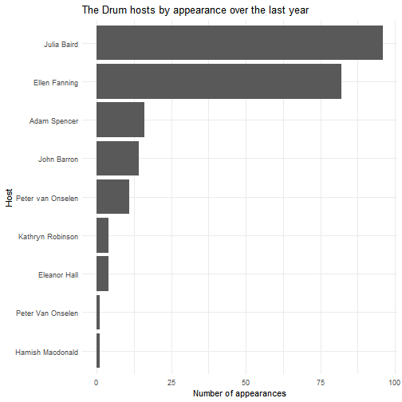

This script scrapes data on the hosts, panellists and guests of [The Drum](www.abc.net.au/news/programs/the-drum) from the ABC website. If you just want to grab some tidy data, it's currently in `drum_tidy.csv`. It goes back a year, as far as I can tell.

**&*Note:** the formatted datetimes in the `dt` column are in UTC! You'll never to convert them to `"Australia/Sydney"` before using them.

To grab the data from the ABC site yourself, run this notebook!


Let's scrape data from the ABC website and find out how often people appear!


```r
drum_url = 'http://www.abc.net.au/news/programs/the-drum/'
pages = 1:10
episodes_id = 'collectionId-4'

# download data
episodes =
  map_dfr(pages, function(x) {
    episode_page =
      read_html(glue('{drum_url}?page={x}')) %>%
      html_nodes(glue('#{episodes_id} article'))
    data_frame(
      title       = episode_page %>% html_nodes('h3') %>% html_text(),
      description = episode_page %>% html_nodes('p') %>% html_text())
  }) %>%
  print()
```

```
## # A tibble: 250 x 2
##    title                                 description                      
##    <chr>                                 <chr>                            
##  1 "\n\n The Drum Thursday July 26 \n "  Host: Julia Baird Panel: Geraldi~
##  2 "\n\n The Drum Wednesday July 25 \n " Host: Julia Baird Panel: Alice W~
##  3 "\n\n The Drum Tuesday July 24 \n "   Host: Peter van Onselen Panel: A~
##  4 "\n\n The Drum Monday July 23 \n "    Host: Peter van Onselen Panel: E~
##  5 "\n\n The Drum Friday July 20 \n "    Host: Julia Baird Panel: Sunil B~
##  6 "\n\n The Drum Thursday July 19 \n "  Host: Peter van Onselen Panel: B~
##  7 "\n\n The Drum Wednesday July 18 \n " Host: Julia Baird Panel: Nicki H~
##  8 "\n\n The Drum Tuesday July 17 \n "   Host: Peter van Onselen Panel: K~
##  9 "\n\n The Drum Monday July 16 \n "    Host: Peter van Onselen Panel: J~
## 10 "\n\n The Drum Friday July 13 \n "    Host: Peter van Onselen Panel: L~
## # ... with 240 more rows
```

Okay, let's tidy it up and get the good bits out (regex makes me cry).


```r
episodes %<>%
  # format the date
  mutate(
    ep_date = str_replace_all(title, c("\n\n The Drum " = "", " \n" = "", "- " = "", "\\s$" = "")),
    dt = parse_date_time(ep_date, orders = "A, B d", tz = "Australia/Sydney")) %>%
  # isolate the host and people
  mutate(
    host = str_extract(description, regex("(?<=Host: )(.*)(?= Panel:)",
      dotall = TRUE)),
    panel = str_extract(description,
      regex(paste0("(?<=Panel: )(.*)(?=( Guest:| Guests:| Interview with:|",
        "The panel|We have))"),
      ignore_case = TRUE, dotall = TRUE))) %>%
  # separate guest and/or interviewees...
  mutate(
    guest = str_extract(panel, regex("(?<=Guest: )(.*)$", dotall = TRUE, ignore_case = TRUE)),
    interviewee = str_extract(panel, regex("(?<=Interview with: )(.*)$", dotall = TRUE, ignore_case = TRUE))) %>%
  # ... and remove them from the panel
  mutate(
    panel = str_replace(panel, regex("Guest: (.*)$"), ""),
    panel = str_replace(panel, regex("Interview with: (.*)$"), ""),
    panel = str_replace(panel, "\\.$", "")) %>%
  select(ep_date, dt, host, panel, guest, interviewee) %>%
  print()
```

```
## Warning: 3 failed to parse.
```

```
## # A tibble: 250 x 6
##    ep_date           dt                  host   panel    guest interviewee
##    <chr>             <dttm>              <chr>  <chr>    <chr> <chr>      
##  1 Thursday July 26  2018-07-26 00:00:00 Julia~ Geraldi~ "Bre~ <NA>       
##  2 Wednesday July 25 2018-07-25 00:00:00 Julia~ "Alice ~ <NA>  <NA>       
##  3 Tuesday July 24   2018-07-24 00:00:00 Peter~ "Adam C~ <NA>  <NA>       
##  4 Monday July 23    2018-07-23 00:00:00 Peter~ "Elaine~ <NA>  <NA>       
##  5 Friday July 20    2018-07-20 00:00:00 Julia~ "Sunil ~ <NA>  <NA>       
##  6 Thursday July 19  2018-07-19 00:00:00 Peter~ "Bhakth~ <NA>  <NA>       
##  7 Wednesday July 18 2018-07-18 00:00:00 Julia~ "Nicki ~ <NA>  <NA>       
##  8 Tuesday July 17   2018-07-17 00:00:00 Peter~ Katie A~ <NA>  <NA>       
##  9 Monday July 16    2018-07-16 00:00:00 Peter~ James M~ <NA>  <NA>       
## 10 Friday July 13    2018-07-13 00:00:00 Peter~ "Lisa A~ <NA>  <NA>       
## # ... with 240 more rows
```

Okay, now let's break these names up:


```r
episodes %<>%
  gather(key = "role", value = "name", host, panel, guest, interviewee) %>%
  separate_rows(name, sep = ", and |, | and ") %>%
  # remove any trailing spaces that snuck in
  mutate(name = str_replace_all(name, "\\s$", "")) %T>%
  write_csv('drum_tidy.csv') %T>%
  print()
```

```
## # A tibble: 1,578 x 4
##    ep_date           dt                  role  name             
##    <chr>             <dttm>              <chr> <chr>            
##  1 Thursday July 26  2018-07-26 00:00:00 host  Julia Baird      
##  2 Wednesday July 25 2018-07-25 00:00:00 host  Julia Baird      
##  3 Tuesday July 24   2018-07-24 00:00:00 host  Peter van Onselen
##  4 Monday July 23    2018-07-23 00:00:00 host  Peter van Onselen
##  5 Friday July 20    2018-07-20 00:00:00 host  Julia Baird      
##  6 Thursday July 19  2018-07-19 00:00:00 host  Peter van Onselen
##  7 Wednesday July 18 2018-07-18 00:00:00 host  Julia Baird      
##  8 Tuesday July 17   2018-07-17 00:00:00 host  Peter van Onselen
##  9 Monday July 16    2018-07-16 00:00:00 host  Peter van Onselen
## 10 Friday July 13    2018-07-13 00:00:00 host  Peter van Onselen
## # ... with 1,568 more rows
```

Nowe we can visualise. For example, here are hosts by frequency:


```r
episodes %>%
  filter(role == "host") %>%
  group_by(name) %>%
  summarise(n = n()) %>%
  ungroup() %>%
  drop_na(name) %T>%
  print() %>%
  {
    ggplot(., aes(x = reorder(name, n), y = n)) +
      geom_col() +
      coord_flip() +
      theme_minimal() +
      labs(
        x = 'Host',
        y = 'Number of appearances',
        title = 'The Drum hosts by appearance over the last year')
  }
```

```
## # A tibble: 9 x 2
##   name                  n
##   <chr>             <int>
## 1 Adam Spencer         16
## 2 Eleanor Hall          4
## 3 Ellen Fanning        82
## 4 Hamish Macdonald      1
## 5 John Barron          14
## 6 Julia Baird          96
## 7 Kathryn Robinson      4
## 8 Peter van Onselen    11
## 9 Peter Van Onselen     1
```



And here's guests, panellists and interviewees:


```r
episodes %>%
  filter(role != "host") %>%
  group_by(name, role) %>%
  summarise(n = n()) %>%
  ungroup() %>%
  drop_na(name) %>%
  top_n(30, n) %T>%
  print() %>%
  {
    ggplot(., aes(x = reorder(name, n), y = n)) +
      geom_col() +
      coord_flip() +
      theme_minimal(base_size = 8) +
      labs(
        x = 'Host',
        y = 'Number of appearances',
        title = 'Top 30 non-host appearance on THe Drum over the last year')
  }
```

```
## # A tibble: 45 x 3
##    name                role      n
##    <chr>               <chr> <int>
##  1 Aaron Patrick       panel     7
##  2 Adam Carrel         panel     6
##  3 Adam Creighton      panel     8
##  4 Amanda Rose         panel     5
##  5 Angela Vithoulkas   panel     9
##  6 Avril Henry         panel     7
##  7 Caroline Overington panel    10
##  8 Dr Darren Saunders  panel     5
##  9 Elaine Pearson      panel     5
## 10 Emma Dawson         panel     5
## # ... with 35 more rows
```


