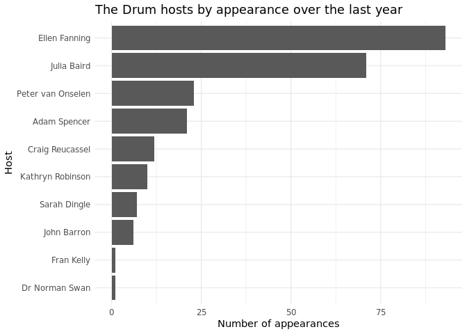
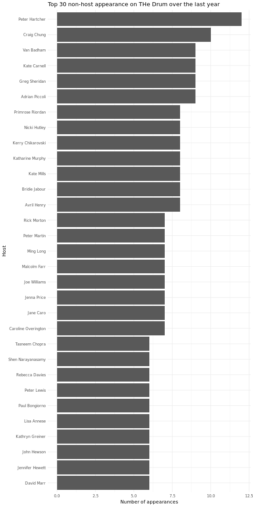

<!-- README.md is generated from README.Rmd. Please edit that file -->

# Analysis of The Drum hosts, panellists and guests

This script scrapes data on the hosts, panellists and guests of [The
Drum](www.abc.net.au/news/programs/the-drum) from the ABC website. If
you just want to grab some tidy data, it’s currently in
[`drum_tidy.csv`](drum_tidy.csv). It goes back to 27 April 2018 (as at
2019-05-13).

**Note:** the formatted datetimes in the `dt` column are in UTC\! You’ll
need to convert them to `"Australia/Sydney"` before using them.

To grab the data from the ABC site yourself, run this notebook\!

Let’s scrape data from the ABC website and find out how often people
appear\!

``` r

drum_url = 'http://www.abc.net.au/news/programs/the-drum/'
pages = 1:10
episodes_id = 'collectionId-4'

# download data
episodes =
  map_dfr(pages, function(x) {
    episode_page =
      read_html(glue('{drum_url}?page={x}')) %>%
      html_nodes(glue('#{episodes_id} article'))
    tibble(
      title       = episode_page %>% html_nodes('h3') %>% html_text(),
      description = episode_page %>% html_nodes('p') %>% html_text())
  }) %>%
  print()
#> # A tibble: 250 x 2
#>    title                    description                                    
#>    <chr>                    <chr>                                          
#>  1 "\n\n The Drum Friday M… Host: Ellen Fanning Panel: Kate Mills, David M…
#>  2 "\n\n Health Care Speci… Host: Ellen Fanning Panel: Pat Turner, Profess…
#>  3 "\n\n The Drum Wednesda… Host: Kathryn Robinson Panel: Geraldine Doogue…
#>  4 "\n\n Corangamite Speci… Host: Ellen Fanning Panel: Dr Fiona Gray, Gabr…
#>  5 "\n\n The Drum Monday M… "Host: Kathryn Robinson Panel: Kathryn Greiner…
#>  6 "\n\n The Drum Friday M… Host: Ellen Fanning Panel: Nicki Hutley, Peter…
#>  7 "\n\n The Drum Thursday… Host: Kathryn Robinson Panel: Robyn Parker, Ja…
#>  8 "\n\n The Drum Wednesda… Host: Kathryn Robinson Panel: Amanda Rose, Kat…
#>  9 "\n\n The Drum Tuesday … Host: Ellen Fanning Panel: Jenna Price, Scott …
#> 10 "\n\n The Drum Monday A… In a special episode, our panel of Indigenous …
#> # … with 240 more rows
```

Okay, let’s tidy it up and get the good bits out (regex makes me cry).

``` r
episodes %<>%
  # format the date
  mutate(
    ep_date = str_replace_all(title, c("\n\n The Drum " = "", " \n" = "", "- " = "", "\\s$" = "")),
    dt = parse_date_time(ep_date, orders = "A, B d", tz = "Australia/Sydney")) %>%
  # isolate the host and people
  mutate(
    host = str_extract(description, regex("(?<=Host: )(.*)(?= Panel:)",
      dotall = TRUE)),
    panel = str_extract(description,
      regex(paste0("(?<=Panel: )(.*)(?=( Guest:| Guests:| Interview with:|",
        "The panel|We have))"),
      ignore_case = TRUE, dotall = TRUE))) %>%
  # separate guest and/or interviewees...
  mutate(
    guest = str_extract(panel, regex("(?<=Guest: )(.*)$", dotall = TRUE, ignore_case = TRUE)),
    interviewee = str_extract(panel, regex("(?<=Interview with: )(.*)$", dotall = TRUE, ignore_case = TRUE))) %>%
  # ... and remove them from the panel
  mutate(
    panel = str_replace(panel, regex("Guest: (.*)$"), ""),
    panel = str_replace(panel, regex("Interview with: (.*)$"), ""),
    panel = str_replace(panel, "\\.$", "")) %>%
  select(ep_date, dt, host, panel, guest, interviewee) %>%
  print()
#> Warning: 17 failed to parse.
#> # A tibble: 250 x 6
#>    ep_date    dt                  host    panel         guest   interviewee
#>    <chr>      <dttm>              <chr>   <chr>         <chr>   <chr>      
#>  1 Friday May NA                  Ellen … "Kate Mills,… <NA>    <NA>       
#>  2 "\n\n Hea… NA                  Ellen … "Pat Turner,… <NA>    <NA>       
#>  3 Wednesday  NA                  Kathry… "Geraldine D… <NA>    <NA>       
#>  4 "\n\n Cor… NA                  Ellen … "Dr Fiona Gr… <NA>    <NA>       
#>  5 Monday Ma… 2019-05-06 00:00:00 Kathry… "Kathryn Gre… "John … <NA>       
#>  6 Friday Ma… 2019-05-03 00:00:00 Ellen … "Nicki Hutle… "Ece T… <NA>       
#>  7 Thursday … 2019-05-02 00:00:00 Kathry… "Robyn Parke… "Shane… <NA>       
#>  8 Wednesday… 2019-05-01 00:00:00 Kathry… "Amanda Rose… <NA>    <NA>       
#>  9 Tuesday A… 2019-04-30 00:00:00 Ellen … "Jenna Price… "Sarah… <NA>       
#> 10 Monday Ap… 2019-04-29 00:00:00 <NA>    <NA>          <NA>    <NA>       
#> # … with 240 more rows
```

Okay, now let’s break these names up:

``` r
episodes %<>%
  gather(key = "role", value = "name", host, panel, guest, interviewee) %>%
  separate_rows(name, sep = ", and |, | and ") %>%
  # remove any trailing spaces that snuck in
  mutate(name = str_replace_all(name, "\\s$", "")) %T>%
  write_csv('drum_tidy.csv') %T>%
  print()
#> # A tibble: 1,733 x 4
#>    ep_date                    dt                  role  name            
#>    <chr>                      <dttm>              <chr> <chr>           
#>  1 Friday May                 NA                  host  Ellen Fanning   
#>  2 "\n\n Health Care Special" NA                  host  Ellen Fanning   
#>  3 Wednesday                  NA                  host  Kathryn Robinson
#>  4 "\n\n Corangamite Special" NA                  host  Ellen Fanning   
#>  5 Monday May 6               2019-05-06 00:00:00 host  Kathryn Robinson
#>  6 Friday May 3               2019-05-03 00:00:00 host  Ellen Fanning   
#>  7 Thursday May 2             2019-05-02 00:00:00 host  Kathryn Robinson
#>  8 Wednesday May 1            2019-05-01 00:00:00 host  Kathryn Robinson
#>  9 Tuesday April 30           2019-04-30 00:00:00 host  Ellen Fanning   
#> 10 Monday April 29            2019-04-29 00:00:00 host  <NA>            
#> # … with 1,723 more rows
```

Nowe we can visualise. For example, here are hosts by frequency:

``` r
episodes %>%
  filter(role == "host") %>%
  group_by(name) %>%
  summarise(n = n()) %>%
  ungroup() %>%
  drop_na(name) %T>%
  print() %>%
  {
    ggplot(., aes(x = reorder(name, n), y = n)) +
      geom_col() +
      coord_flip() +
      theme_minimal() +
      labs(
        x = 'Host',
        y = 'Number of appearances',
        title = 'The Drum hosts by appearance over the last year')
  }
#> # A tibble: 10 x 2
#>    name                  n
#>    <chr>             <int>
#>  1 Adam Spencer         21
#>  2 Craig Reucassel      12
#>  3 Dr Norman Swan        1
#>  4 Ellen Fanning        93
#>  5 Fran Kelly            1
#>  6 John Barron           6
#>  7 Julia Baird          71
#>  8 Kathryn Robinson     10
#>  9 Peter van Onselen    23
#> 10 Sarah Dingle          7
```

<!-- -->

And here’s guests, panellists and interviewees:

``` r
episodes %>%
  filter(role != "host") %>%
  group_by(name, role) %>%
  summarise(n = n()) %>%
  ungroup() %>%
  drop_na(name) %>%
  top_n(30, n) %T>%
  print() %>%
  {
    ggplot(., aes(x = reorder(name, n), y = n)) +
      geom_col() +
      coord_flip() +
      theme_minimal(base_size = 8) +
      labs(
        x = 'Host',
        y = 'Number of appearances',
        title = 'Top 30 non-host appearance on THe Drum over the last year')
  }
#> # A tibble: 31 x 3
#>    name                role      n
#>    <chr>               <chr> <int>
#>  1 Adrian Piccoli      panel     9
#>  2 Avril Henry         panel     8
#>  3 Bridie Jabour       panel     8
#>  4 Caroline Overington panel     7
#>  5 Craig Chung         panel    10
#>  6 David Marr          panel     6
#>  7 Greg Sheridan       panel     9
#>  8 Jane Caro           panel     7
#>  9 Jenna Price         panel     7
#> 10 Jennifer Hewett     panel     6
#> # … with 21 more rows
```

<!-- -->
